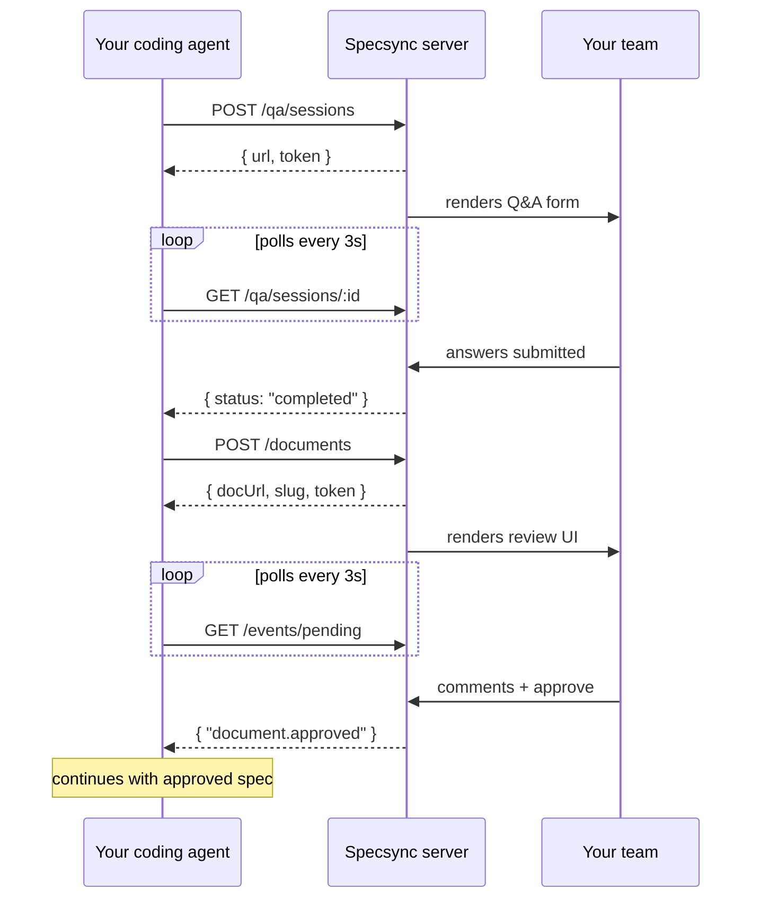
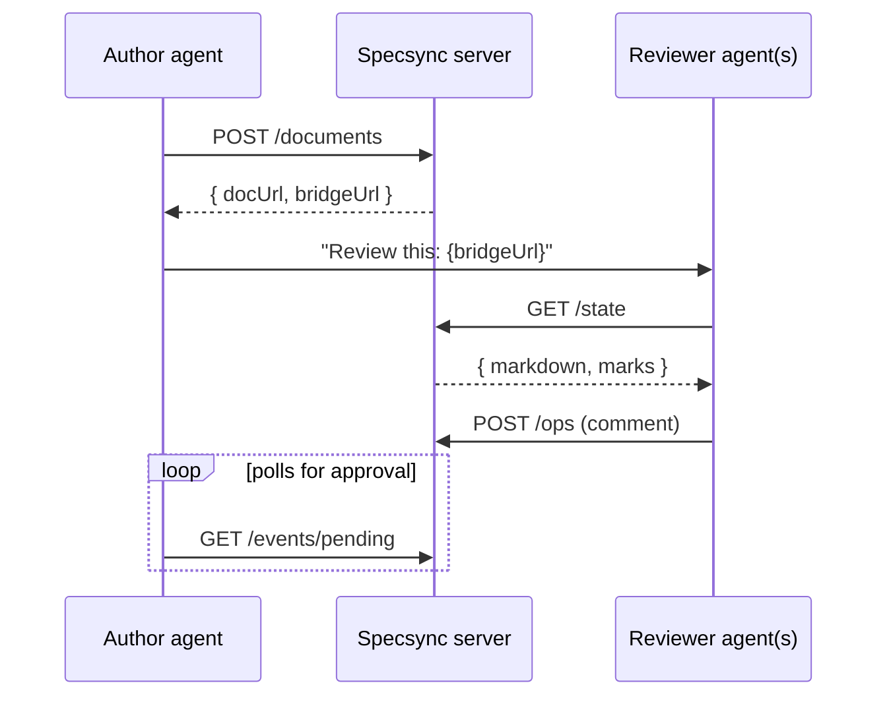

# Specsync

[](https://github.com/hjgraca/specsync/actions/workflows/test.yml)
[](https://www.npmjs.com/package/@specsync/server)

Collaborative spec review and team Q&A for AI coding agents.

Your agent asks questions, proposes specs, and waits for review. Your team answers and approves in the browser.


## What it does

Specsync gives AI coding agents a shared workspace for human input and review.

- **Ask the team questions** — Agents post structured questions with options and recommendations. Your team answers in a browser, and the agent continues when decisions are made.
- **Review specs collaboratively** — Agents publish plans or specs for review. Your team comments inline, suggests changes, and approves or requests revisions.
- **Support any agent** — Works with Claude Code, Cursor, OpenCode, Copilot, Kiro, Pi, or any agent with shell access. No plugin required — just HTTP and `curl`.

## Why Specsync?

AI agents are good at generating plans and code, but team collaboration usually still happens in chat threads, terminal copy-paste, or one-on-one conversations.

Specsync moves that workflow into a shared browser interface so decisions, feedback, and approvals happen in one place.

| Problem | Without Specsync | With Specsync |
|---------|------------------|---------------|
| Agent asks a question | The question stays in one person's terminal | The whole team can answer in a shared form |
| Agent proposes a spec | One person reviews alone in the CLI | The team reviews in the browser with inline comments |
| Approval is needed | Feedback gets scattered across chat and threads | Approval happens in a structured review flow |
| Multiple reviewers are involved | Everyone responds separately | Comments stay threaded in one place |
| The agent revises after feedback | Context gets lost across versions | The same review URL stays active with history preserved |

## Quick Start

Install the agent skills:

```bash
npx skills add hjgraca/specsync
```

Then run:

```text
/specsync-setup
```

Enter the URL of any Specsync server — cloud, shared, or local.

After that, tell your agent:

- **"ask the team"**
- **"submit for review"**

Run a server locally:

```bash
npx @specsync/server
```

Or with Docker:

```bash
docker run -p 4000:4000 ghcr.io/hjgraca/specsync
```

For shared team use, see [Deploy to the Cloud](#deploy-to-the-cloud).

## Screenshots

### Q&A UI

Agents post questions with options and recommendations. Your team answers in the browser, and the first completed response is immediately visible.


### Spec Review UI

Agents publish markdown specs for review. Humans and AI reviewers comment inline, reply in threads, and approve or request changes.


## How it works



Typical flow:

1. The agent creates a Q&A session or publishes a spec
2. Specsync renders it in the browser with a shareable URL
3. Your team answers or reviews collaboratively
4. The agent polls for updates and continues when review is complete

## Example: What your agent does

When you say **"ask the team what database to use"**, your agent can create a Q&A session like this:

```bash
# Reads server URL from .specsync.json (for example: https://specsync.yourteam.com)

curl -s -X POST $SPECSYNC_URL/qa/sessions \
  -H "Content-Type: application/json" \
  -d @- << 'EOF'
{
  "title": "Database Decision",
  "questions": [{
    "id": "db",
    "title": "What database should we use for the user service?",
    "recommendation": "Postgres — already in the stack and the team knows it well.",
    "options": [
      {"key": "pg", "label": "Postgres", "recommended": true},
      {"key": "mongo", "label": "MongoDB"},
      {"key": "dynamo", "label": "DynamoDB"}
    ],
    "type": "single-select"
  }]
}
EOF
```

The agent then shares the browser URL, waits for responses, and continues with the selected decision.

## Set up your agent

### Option A: Install with the skills CLI

Use the [Agent Skills](https://github.com/vercel-labs/skills) CLI to install Specsync for your detected agents, including Claude Code, Cursor, Copilot, Kiro, OpenCode, and others:

```bash
npx skills add hjgraca/specsync
```

The CLI detects compatible agents, lets you choose which skills to install (`specsync` and `specsync-setup`), and places the files in the correct directories.

Then tell your agent to run:

```text
/specsync-setup
```

This creates a `.specsync.json` file pointing the agent at your shared or local Specsync server.

### Option B: Paste this into your agent

If you prefer manual setup, paste this into your agent chat:

```text
Set up specsync for collaborative spec review.

1. Download the skill file:
   curl -s https://raw.githubusercontent.com/hjgraca/specsync/main/skills/specsync/SKILL.md \
     -o .claude/skills/specsync/SKILL.md --create-dirs

2. Download the setup skill:
   curl -s https://raw.githubusercontent.com/hjgraca/specsync/main/skills/specsync-setup/SKILL.md \
     -o .claude/skills/specsync-setup/SKILL.md --create-dirs

3. Write .specsync.json to the project root:
   {"serverUrl": "https://specsync.yourteam.com"}

4. Restart your agent session so the new skills are discovered.
```

Replace `.claude` with your agent's skill directory, such as `.cursor`, `.agents`, `.kiro`, or similar.

## Deploy to the Cloud

For team use, deploy Specsync to a shared URL so all agents and reviewers connect to the same instance.

| Cloud | Service | Guide |
|-------|---------|-------|
| AWS | App Runner (CDK) | [docs/guides/deploy-aws.md](docs/guides/deploy-aws.md) |
| GCP | Cloud Run | [docs/guides/deploy-gcp.md](docs/guides/deploy-gcp.md) |
| Azure | Container Apps | [docs/guides/deploy-azure.md](docs/guides/deploy-azure.md) |
| Railway | Railway | [docs/guides/deploy-railway.md](docs/guides/deploy-railway.md) |
| Fly.io | Fly Machines | [docs/guides/deploy-flyio.md](docs/guides/deploy-flyio.md) |

After deployment, run `/specsync-setup` in your agent and enter the deployed URL. The URL is saved in `.specsync.json` so your agents use it automatically.

## Integration Guides

| Agent | Guide |
|-------|-------|
| Claude Code | [docs/guides/claude-code.md](docs/guides/claude-code.md) |
| Cursor | [docs/guides/cursor.md](docs/guides/cursor.md) |
| OpenCode | [docs/guides/opencode.md](docs/guides/opencode.md) |
| Copilot CLI | [docs/guides/copilot-cli.md](docs/guides/copilot-cli.md) |
| Kiro | [docs/guides/kiro.md](docs/guides/kiro.md) |
| Pi | [docs/guides/pi.md](docs/guides/pi.md) |
| Any agent | [docs/guides/manual.md](docs/guides/manual.md) |

## AI Agent Reviewers (Bridge API)

Specsync also supports multi-agent review.

When a document is created, the response includes a `bridgeUrl`. You can hand that URL to another agent so it can review the same spec, post comments, and participate alongside your team.



How to use it:

1. Your authoring agent submits a spec and receives the `bridgeUrl`
2. Pass the `bridgeUrl` to another agent, such as a security reviewer, performance reviewer, CI bot, or domain expert agent
3. That reviewer agent reads the spec and posts comments through the Bridge API

Example:

```bash
# Reviewer reads the spec
curl -s "$BRIDGE_URL/state" -H "x-share-token: $TOKEN"

# Reviewer posts a comment
curl -s -X POST "$BRIDGE_URL/ops" \
  -H "x-share-token: $TOKEN" \
  -H "Content-Type: application/json" \
  -d '{"type":"comment.add","by":"ai:security-reviewer","quote":"the relevant text","text":"Consider rate limiting here"}'
```

This makes it easy to run specialized AI reviewers in parallel while keeping all feedback in the same review thread.

## API Reference

See [docs/api-reference.md](docs/api-reference.md) for the full HTTP API.

### Quick overview

| Method | Endpoint | Purpose |
|--------|----------|---------|
| POST | `/qa/sessions` | Create a Q&A session |
| GET | `/qa/sessions/:id?token=` | Get session status and answers |
| POST | `/qa/sessions/:id/answer?token=` | Submit an answer |
| POST | `/documents` | Create a review document |
| GET | `/documents/:slug/state` | Get document and comments |
| PUT | `/documents/:slug` | Update document content |
| POST | `/documents/:slug/ops` | Add a comment, reply, or approval |
| GET | `/documents/:slug/events/pending?since=` | Poll for review decisions |

## Configuration

### Agent-side

The recommended setup is a `.specsync.json` file in your project root, committed to the repository so every team member's agent points to the same server:

```json
{"serverUrl": "https://specsync.yourteam.com"}
```

You can create this file interactively by running:

```text
/specsync-setup
```

Resolution order:

1. `.specsync.json`
2. `REVIEW_TOOL_URL` environment variable
3. `http://localhost:4000`

### Server-side

| Environment variable | Default | Description |
|----------------------|---------|-------------|
| `PORT` | `4000` | Server port |
| `HOST` | `0.0.0.0` | Bind address |
| `REVIEW_TOOL_DB_PATH` | `./specsync.db` | SQLite database path |

## Packages

| Package | Purpose | Install |
|---------|---------|---------|
| [`@specsync/server`](packages/server) | Run the Specsync server | `npx @specsync/server` |
| [`@specsync/sdk`](packages/sdk) | TypeScript SDK for programmatic integration | `npm install @specsync/sdk` |
| [Skills](skills/) | Agent skill files installed via `npx skills add` | `npx skills add hjgraca/specsync` |

## Features

- **Deploy anywhere** — Run in the cloud, on a shared machine, or locally.
- **Shared team review** — Keep questions, comments, and approvals in one place.
- **Multi-agent review** — Add specialized reviewer agents alongside human reviewers.
- **No login required** — Share a URL and start collaborating immediately.
- **Real-time presence** — See who is viewing a Q&A or review session.
- **QR codes** — Open sessions quickly on mobile devices.
- **Approval workflow** — Keep specs in review until explicitly approved or rejected.
- **Revision-friendly** — Update a spec while preserving comments and review context.
- **Simple storage** — Uses SQLite with automatic cleanup for abandoned sessions.
- **Agent-agnostic** — Works with any agent that can make HTTP requests.

## Development

```bash
pnpm install
pnpm dev             # start server + vite dev server with hot reload
pnpm build           # build all packages
pnpm test            # run unit tests
npx playwright test  # run Playwright end-to-end tests
```

## Contributing

See [CONTRIBUTING.md](CONTRIBUTING.md) for setup instructions and contribution guidelines.

## Security

See [SECURITY.md](SECURITY.md) for how to report vulnerabilities.

## License

MIT
