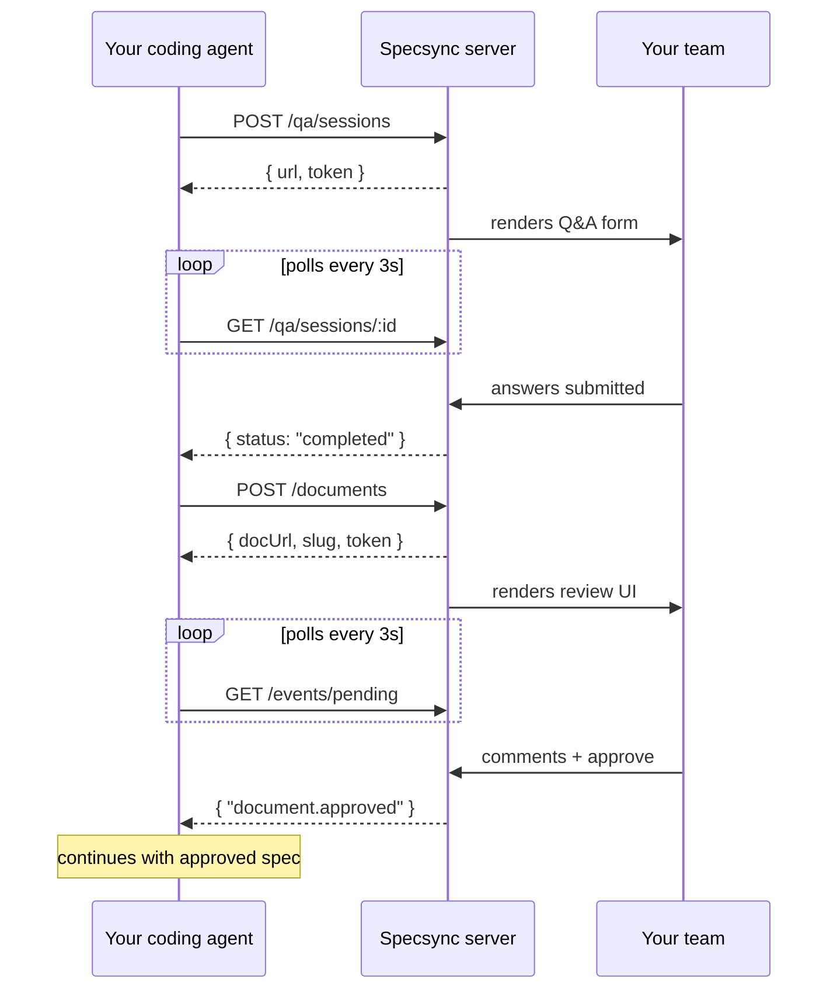
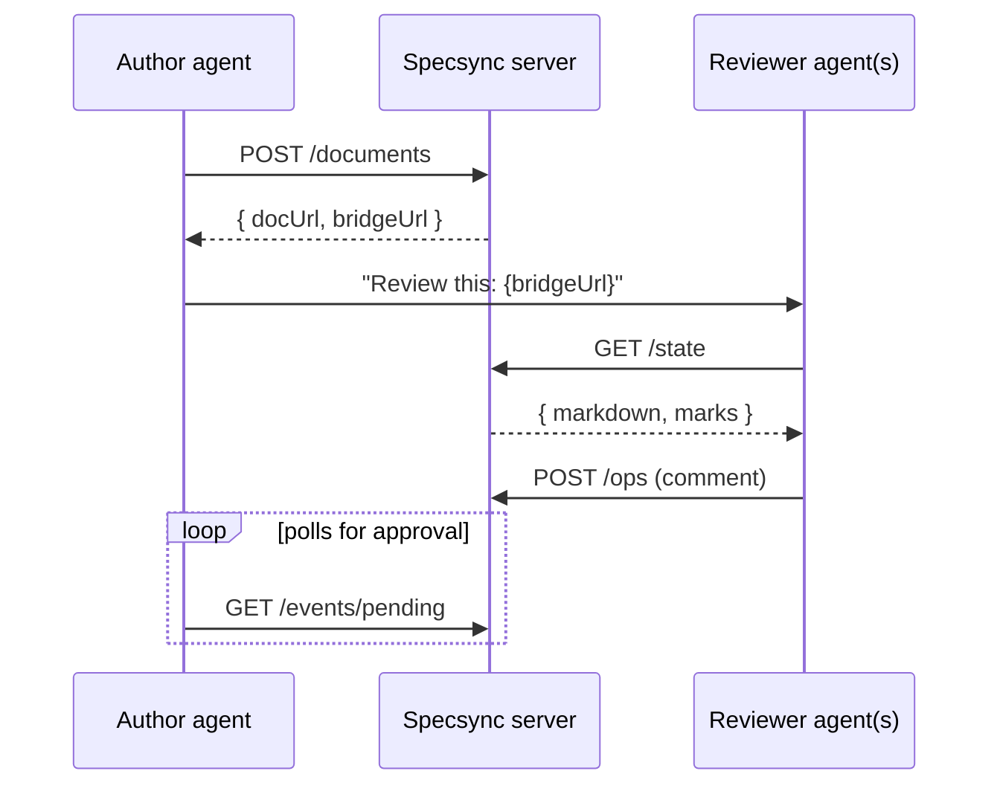

# Specsync

[](https://github.com/hjgraca/specsync/actions/workflows/test.yml)
[](https://www.npmjs.com/package/@specsync/server)

Collaborative spec review for AI coding agents. Your agent asks questions and submits specs — your team answers and reviews in the browser.


## What it does

**Q&A** — Your agent posts structured questions. Your team answers in a shared form. The agent polls and continues once answers arrive.

**Spec Review** — Your agent publishes a plan or spec. Your team reviews with inline comments and suggestions. Approve or request changes. AI review agents can participate too.

**Any agent** — Works with Claude Code, Cursor, OpenCode, Copilot, Kiro, Pi, or any agent with shell access. No plugins required — just HTTP + curl.

## Quick Start

```bash
# 1. Install skills for your agents
npx skills add hjgraca/specsync

# 2. Point your agent at any specsync server
#    Run /specsync-setup and enter the URL (cloud, shared, or local)
```

Then tell your agent: **"ask the team"** or **"submit for review"**

The server can run anywhere your team can reach — a cloud deployment, a shared machine, or locally for solo use. See [Deploy to the Cloud](#deploy-to-the-cloud) for hosted options, or run it locally:

```bash
npx @specsync/server                        # npm
docker run -p 4000:4000 ghcr.io/hjgraca/specsync  # Docker
```

## Set Up Your Agent

### Option A: Install with the skills CLI

Uses the [Agent Skills](https://github.com/vercel-labs/skills) CLI to install for all your detected agents (Claude Code, Cursor, Copilot, Kiro, OpenCode, and more):

```bash
npx skills add hjgraca/specsync
```

The CLI will detect your installed agents, let you pick which skills to install (`specsync` and `specsync-setup`), and place the skill files in the right directories.

After installation, tell your agent to run `/specsync-setup` to configure the server URL and create `.specsync.json`. This points your agent at whatever server your team uses — cloud, shared, or local.

### Option B: Paste this into your agent

Paste this into your agent's chat:

```
Set up specsync for collaborative spec review.

1. Download the skill file:
   curl -s https://raw.githubusercontent.com/hjgraca/specsync/main/skills/specsync/SKILL.md \
     -o .claude/skills/specsync/SKILL.md --create-dirs

2. Download the setup skill:
   curl -s https://raw.githubusercontent.com/hjgraca/specsync/main/skills/specsync-setup/SKILL.md \
     -o .claude/skills/specsync-setup/SKILL.md --create-dirs

3. Write .specsync.json to the project root:
   {"serverUrl": "https://specsync.yourteam.com"}

4. Restart your agent session so the new skills are discovered.
```

Replace `.claude` with your agent's skill directory (`.cursor`, `.agents`, `.kiro`, etc.).

## Packages

| Package | Purpose | Install |
|---------|---------|---------|
| [`@specsync/server`](packages/server) | Run the specsync server | `npx @specsync/server` |
| [`@specsync/sdk`](packages/sdk) | TypeScript SDK for programmatic integration | `npm install @specsync/sdk` |
| [Skills](skills/) | Agent skill files (installed via `npx skills add`) | `npx skills add hjgraca/specsync` |

## How it works



1. Agent calls specsync API (creates Q&A session or publishes spec)
2. Specsync renders it in the browser (shareable URL, QR code)
3. Team answers or reviews collaboratively — real-time presence shows who's online
4. Agent polls for completion, gets results, continues working

## AI Agent Reviewers (Bridge API)

Any agent can join a spec review as a reviewer — post comments, reply to threads, and participate alongside your human team. When a document is created, the response includes a `bridgeUrl`. Hand that URL to another agent and it can review the spec autonomously.



**How to use it:**

1. Your authoring agent submits a spec and gets back the `bridgeUrl`
2. Pass the `bridgeUrl` to any other agent (Claude Code, Cursor, a CI bot, a dedicated security reviewer agent, etc.)
3. The reviewer agent reads the spec via `GET {bridgeUrl}/state` and posts comments via `POST {bridgeUrl}/ops`:

```bash
# Reviewer reads the spec
curl -s "$BRIDGE_URL/state" -H "x-share-token: $TOKEN"

# Reviewer posts a comment
curl -s -X POST "$BRIDGE_URL/ops" \
  -H "x-share-token: $TOKEN" \
  -H "Content-Type: application/json" \
  -d '{"type":"comment.add","by":"ai:security-reviewer","quote":"the relevant text","text":"Consider rate limiting here"}'
```

This lets you build multi-agent review workflows — a security agent, a performance agent, and a domain expert agent can all review the same spec concurrently, with their comments appearing alongside human feedback in the browser.

## Screenshots

### Q&A UI

Agent posts questions with options and recommendations. Team answers in the browser. First-answered question shows as complete.


### Spec Review UI

Agent publishes a markdown spec. Team and AI reviewers comment inline. Quoted text shows the context. Approve or request changes.


## Deploy to the Cloud

For team use, deploy Specsync to a shared URL so all agents and team members connect to the same instance. Each guide gets you from zero to a live HTTPS URL.

| Cloud | Service | Guide |
|-------|---------|-------|
| AWS | App Runner (CDK) | [docs/guides/deploy-aws.md](docs/guides/deploy-aws.md) |
| GCP | Cloud Run | [docs/guides/deploy-gcp.md](docs/guides/deploy-gcp.md) |
| Azure | Container Apps | [docs/guides/deploy-azure.md](docs/guides/deploy-azure.md) |
| Railway | Railway | [docs/guides/deploy-railway.md](docs/guides/deploy-railway.md) |
| Fly.io | Fly Machines | [docs/guides/deploy-flyio.md](docs/guides/deploy-flyio.md) |

Then tell your agent to run `/specsync-setup` and enter the deployed URL. This saves it to `.specsync.json` so all agents use it automatically.

## Integration Guides

| Agent | Guide |
|-------|-------|
| Claude Code | [docs/guides/claude-code.md](docs/guides/claude-code.md) |
| Cursor | [docs/guides/cursor.md](docs/guides/cursor.md) |
| OpenCode | [docs/guides/opencode.md](docs/guides/opencode.md) |
| Copilot CLI | [docs/guides/copilot-cli.md](docs/guides/copilot-cli.md) |
| Kiro | [docs/guides/kiro.md](docs/guides/kiro.md) |
| Pi | [docs/guides/pi.md](docs/guides/pi.md) |
| Any agent | [docs/guides/manual.md](docs/guides/manual.md) |

## API Reference

See [docs/api-reference.md](docs/api-reference.md) for all HTTP endpoints.

### Quick overview

| Method | Endpoint | Purpose |
|--------|----------|---------|
| POST | `/qa/sessions` | Create a Q&A session |
| GET | `/qa/sessions/:id?token=` | Get session status + answers |
| POST | `/qa/sessions/:id/answer?token=` | Submit an answer |
| POST | `/documents` | Create a review document |
| GET | `/documents/:slug/state` | Get document + comments |
| PUT | `/documents/:slug` | Update document content |
| POST | `/documents/:slug/ops` | Add comment, reply, approve |
| GET | `/documents/:slug/events/pending?since=` | Poll for decisions |

## Configuration

### Agent-side (where to find the server)

The recommended way is `.specsync.json` in your project root — committed to the repo so every team member's agent connects to the same server:

```json
{"serverUrl": "https://specsync.yourteam.com"}
```

Run `/specsync-setup` in your agent to create this file interactively.

Resolution order: `.specsync.json` → `REVIEW_TOOL_URL` env var → `http://localhost:4000`

### Server-side

| Environment variable | Default | Description |
|---------------------|---------|-------------|
| `PORT` | `4000` | Server port |
| `HOST` | `0.0.0.0` | Bind address |
| `REVIEW_TOOL_DB_PATH` | `./specsync.db` | SQLite database path |

## Features

- **Deploy anywhere** — cloud, shared team server, or local. One URL in `.specsync.json` connects all agents.
- **Multi-agent review** — attach reviewer agents (security, performance, domain experts) via the bridge URL. They comment alongside humans.
- **Zero-friction access** — share a URL, no login required. Anonymous codenames for presence.
- **Real-time presence** — see who's viewing the Q&A or review right now.
- **QR codes** — scan to open on mobile, share with teammates.
- **Approval gate** — specs stay in review until explicitly approved or rejected.
- **Revision tracking** — update a spec after feedback, same URL, comments preserved.
- **Ephemeral storage** — SQLite working cache. Abandoned sessions auto-purge after 30 days.
- **Methodology agnostic** — works with any spec format. The agent decides what to submit.

## Why Specsync?

| Problem | Without Specsync | With Specsync |
|---------|-----------------|---------------|
| Agent asks you questions | Questions in CLI, only you see them | Shared Q&A form, whole team answers |
| Agent writes a spec | You review alone in terminal | Team reviews in browser with comments |
| Need team approval | Copy-paste to Slack, wait for reply | Approval gate with structured feedback |
| Multiple reviewers | Everyone asks separately | All comments in one place, threaded |
| Agent revises after feedback | New file, lost context | Same URL, revision history, comments preserved |

## Example: What Your Agent Does

When you say **"ask the team what database to use"**, your agent:

```bash
# Reads server URL from .specsync.json (e.g., https://specsync.yourteam.com)

# 1. Creates a Q&A session on the specsync server
curl -s -X POST $SPECSYNC_URL/qa/sessions \
  -H "Content-Type: application/json" \
  -d @- << 'EOF'
{
  "title": "Database Decision",
  "questions": [{
    "id": "db",
    "title": "What database for the user service?",
    "recommendation": "Postgres — already in the stack, team has expertise.",
    "options": [
      {"key": "pg", "label": "Postgres", "recommended": true},
      {"key": "mongo", "label": "MongoDB"},
      {"key": "dynamo", "label": "DynamoDB"}
    ],
    "type": "single-select"
  }]
}
EOF

# 2. Tells you the URL
# → "Q&A ready at https://specsync.yourteam.com/qa/abc?token=xyz"

# 3. Polls until the team answers
while true; do
  RESP=$(curl -s "$SPECSYNC_URL/qa/sessions/abc?token=xyz")
  # When status="completed", continue with the answer
  sleep 3
done
```

Your team answers in the browser. The agent continues with the decision.

## Development

```bash
pnpm install
pnpm dev             # starts server + vite dev server with hot reload
pnpm build           # build all packages
pnpm test            # run unit tests
npx playwright test  # run Playwright E2E tests
```

## Contributing

See [CONTRIBUTING.md](CONTRIBUTING.md) for setup instructions and guidelines.

## Security

See [SECURITY.md](SECURITY.md) for reporting vulnerabilities.

## License

MIT
