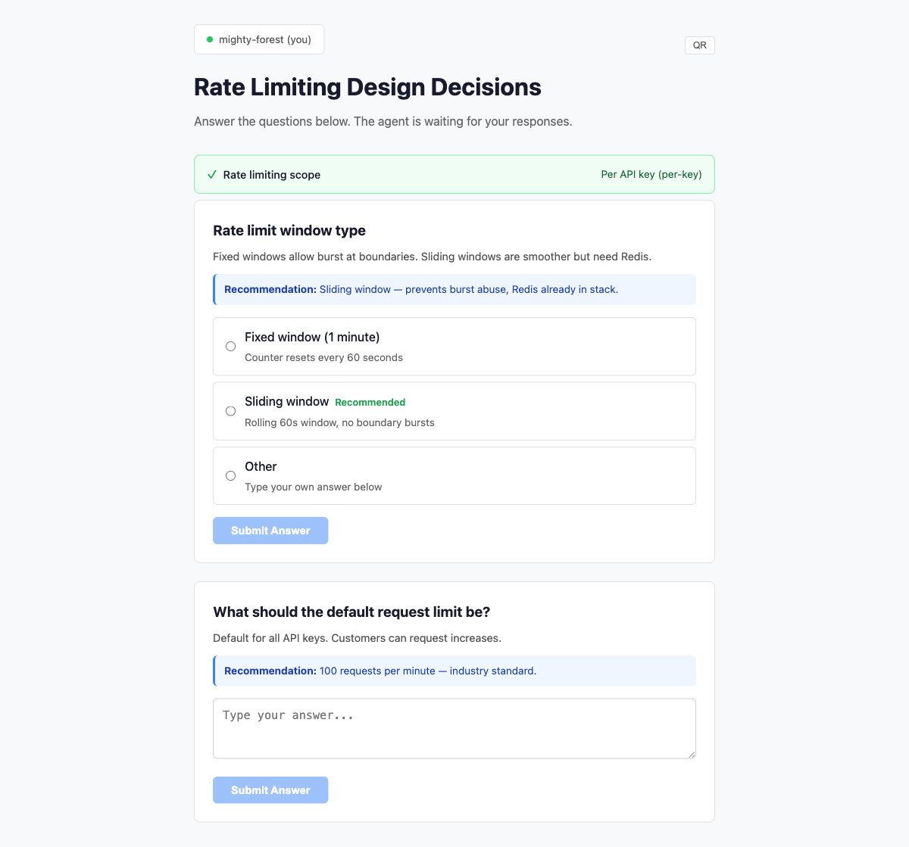
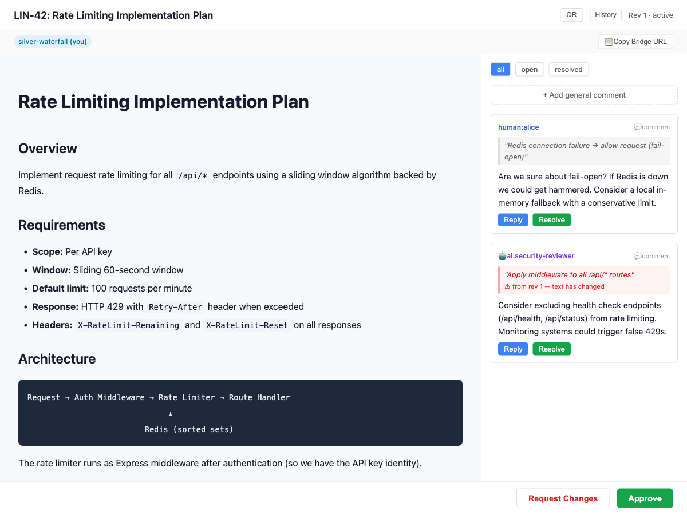
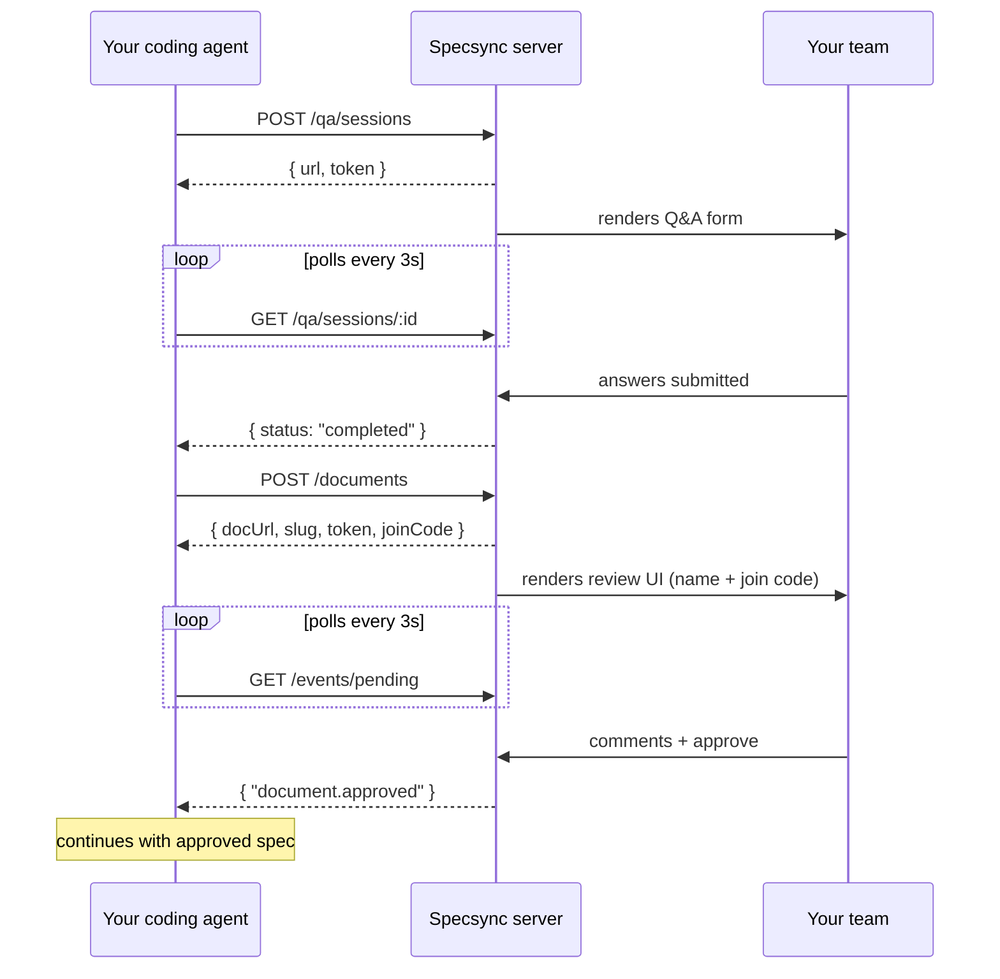
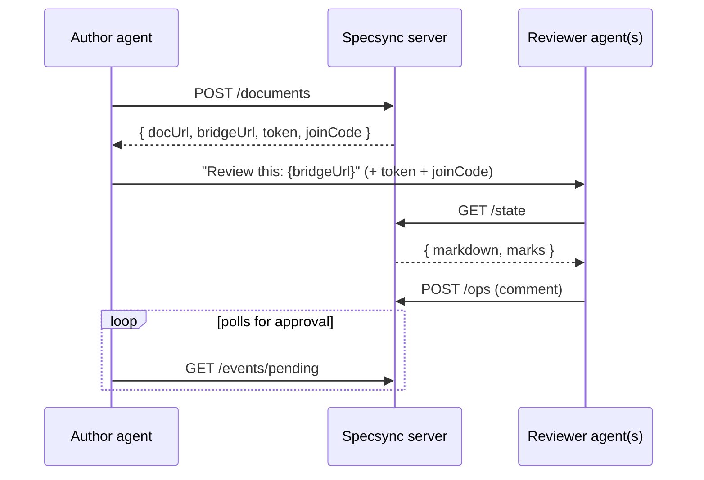

# Specsync

[](https://github.com/hjgraca/specsync/actions/workflows/test.yml)
[](https://www.npmjs.com/package/@specsync/server)
[](https://skills.sh/hjgraca/specsync)

Collaborative spec review and team Q&A for AI coding agents.

Your agent asks questions, proposes specs, and waits for review. Your team answers and approves in the browser.


## What it does

Specsync gives AI coding agents a shared workspace for human input and review.

- **Ask the team questions** — Agents post structured questions with options and recommendations. Your team answers in a browser, and the agent continues when decisions are made.
- **Review specs collaboratively** — Agents publish plans or specs for review. Your team comments inline, suggests changes, and approves or requests revisions.
- **Support any agent** — Works with Claude Code, Cursor, OpenCode, Copilot, Kiro, Pi, or any agent with shell access. No plugin required — just HTTP and `curl`.

When a reviewer opens a document, Specsync asks for their **name** and a short
**join code** (a 6-character code the agent prints alongside the link). Both are
remembered in the browser, so it is a one-time step per person. See
[How access works](#how-access-works) for the full model.

## Why Specsync?

AI agents are good at generating plans and code, but team collaboration usually still happens in chat threads, terminal copy-paste, or one-on-one conversations.

Specsync moves that workflow into a shared browser interface so decisions, feedback, and approvals happen in one place.

| Problem | Without Specsync | With Specsync |
|---------|------------------|---------------|
| Agent asks a question | The question stays in one person's terminal | The whole team can answer in a shared form |
| Agent proposes a spec | One person reviews alone in the CLI | The team reviews in the browser with inline comments |
| Approval is needed | Feedback gets scattered across chat and threads | Approval happens in a structured review flow |
| Multiple reviewers are involved | Everyone responds separately | Comments stay threaded in one place |
| The agent revises after feedback | Context gets lost across versions | The same review URL stays active with history preserved |

## Quick Start

You need two things: a **server** (where reviews live) and the **agent skills**
(so your agent knows how to use it). Here is the fastest path from zero to a
working review.

### 1. Start a server

Run one locally to try it out:

```bash
npx @specsync/server
# → Specsync running at http://localhost:4000
```

Or with Docker:

```bash
docker run -p 4000:4000 ghcr.io/hjgraca/specsync
```

For a team, deploy once to a shared URL so everyone connects to the same place —
see [Deploy to the cloud](#deploy-to-the-cloud).

### 2. Install the agent skills

```bash
npx skills add hjgraca/specsync
```

This installs two skills into your agent: `specsync` (the workflow) and
`specsync-setup` (one-time configuration).

### 3. Point your agent at the server

In your agent, run:

```text
/specsync-setup
```

Enter your server URL (`http://localhost:4000` for local, or your team's shared
URL). This writes `.specsync.json` to your project root so every teammate's
agent uses the same server. Commit that file.

### 4. Use it

Just talk to your agent in plain language:

- **"ask the team which database we should use"** → opens a Q&A form
- **"submit this plan for review"** → opens a review document

Your agent prints a URL and a join code. Share both with your reviewers; they
open the link, enter their name and the code once, and start answering or
commenting. The agent waits and continues automatically when the team responds.

## Screenshots

### Q&A UI

Agents post questions with options and recommendations. Your team answers in the browser, and the first completed response is immediately visible.



### Spec Review UI

Agents publish markdown specs for review. Humans and AI reviewers comment inline, reply in threads, and approve or request changes.



## How it works



Typical flow:

1. The agent creates a Q&A session or publishes a spec
2. Specsync renders it in the browser with a shareable URL (and a join code for reviews)
3. Your team answers or reviews collaboratively
4. The agent polls for updates and continues when review is complete

## How access works

Specsync has no accounts or passwords. Access to a review is controlled by two
short-lived secrets that the agent receives when it creates the document:

| Secret | Who uses it | Where it lives |
|--------|-------------|----------------|
| **Share token** | Agents (and the browser URL) | In the `?token=` of the review URL and the `x-share-token` header |
| **Join code** | Humans, typed in the browser | A 6-character code (e.g. `a1b2c3`) the agent prints next to the URL |

**Why two?** A URL is easy to leak — it lands in chat logs, screen shares, and
browser history. On its own the share token would be enough to read and comment
on a document. The join code is a second factor that is shared out-of-band (you
tell your teammates the code), so a stray URL alone is not enough to get in.

**What reviewers experience:**

1. They open the review URL.
2. Specsync prompts for their **name** and the **join code**.
3. Both are saved in their browser, so returning to the same document — or
   opening a new one with the same code — never re-prompts for the name.
4. If a saved code is rejected (for example, it belongs to a different
   document), Specsync asks for the code again but keeps the name filled in.

**What agents do:** every request to a document endpoint sends both the share
token and the join code (`x-share-token` + `x-join-code`, or `?token=&code=`).
The installed skill and the SDK handle this automatically; for raw HTTP, see the
[API reference](docs/api-reference.md#document-authentication).

> **Note:** Q&A sessions use the share token only — they are lighter-weight and
> do not require a join code. The join code applies to review **documents**.

## Example: What your agent does

When you say **"ask the team what database to use"**, your agent can create a Q&A session like this:

```bash
# Reads server URL from .specsync.json (for example: https://specsync.yourteam.com)

curl -s -X POST $SPECSYNC_URL/qa/sessions \
  -H "Content-Type: application/json" \
  -d @- << 'EOF'
{
  "title": "Database Decision",
  "questions": [{
    "id": "db",
    "title": "What database should we use for the user service?",
    "recommendation": "Postgres — already in the stack and the team knows it well.",
    "options": [
      {"key": "pg", "label": "Postgres", "recommended": true},
      {"key": "mongo", "label": "MongoDB"},
      {"key": "dynamo", "label": "DynamoDB"}
    ],
    "type": "single-select"
  }]
}
EOF
```

The agent then shares the browser URL, waits for responses, and continues with the selected decision.

## Set up your agent

### Option A: Install with the skills CLI

Use the [Agent Skills](https://github.com/vercel-labs/skills) CLI to install Specsync for your detected agents, including Claude Code, Cursor, Copilot, Kiro, OpenCode, and others:

```bash
npx skills add hjgraca/specsync
```

The CLI detects compatible agents, lets you choose which skills to install (`specsync` and `specsync-setup`), and places the files in the correct directories.

Then tell your agent to run:

```text
/specsync-setup
```

This creates a `.specsync.json` file pointing the agent at your shared or local Specsync server.

### Option B: Paste this into your agent

If you prefer manual setup, paste this into your agent chat:

```text
Set up specsync for collaborative spec review.

1. Download the skill file:
   curl -s https://raw.githubusercontent.com/hjgraca/specsync/main/skills/specsync/SKILL.md \
     -o .claude/skills/specsync/SKILL.md --create-dirs

2. Download the setup skill:
   curl -s https://raw.githubusercontent.com/hjgraca/specsync/main/skills/specsync-setup/SKILL.md \
     -o .claude/skills/specsync-setup/SKILL.md --create-dirs

3. Write .specsync.json to the project root:
   {"serverUrl": "https://specsync.yourteam.com"}

4. Restart your agent session so the new skills are discovered.
```

Replace `.claude` with your agent's skill directory, such as `.cursor`, `.agents`, `.kiro`, or similar.

## Deploy to the Cloud

For team use, deploy Specsync to a shared URL so all agents and reviewers connect to the same instance.

| Cloud | Service | Guide |
|-------|---------|-------|
| AWS | Lightsail Container Service (CDK) | [docs/guides/deploy-aws.md](docs/guides/deploy-aws.md) |
| GCP | Cloud Run | [docs/guides/deploy-gcp.md](docs/guides/deploy-gcp.md) |
| Azure | Container Apps | [docs/guides/deploy-azure.md](docs/guides/deploy-azure.md) |
| Railway | Railway | [docs/guides/deploy-railway.md](docs/guides/deploy-railway.md) |
| Fly.io | Fly Machines | [docs/guides/deploy-flyio.md](docs/guides/deploy-flyio.md) |

After deployment, run `/specsync-setup` in your agent and enter the deployed URL. The URL is saved in `.specsync.json` so your agents use it automatically.

## Integration Guides

| Agent | Guide |
|-------|-------|
| Claude Code | [docs/guides/claude-code.md](docs/guides/claude-code.md) |
| Cursor | [docs/guides/cursor.md](docs/guides/cursor.md) |
| OpenCode | [docs/guides/opencode.md](docs/guides/opencode.md) |
| Copilot CLI | [docs/guides/copilot-cli.md](docs/guides/copilot-cli.md) |
| Kiro | [docs/guides/kiro.md](docs/guides/kiro.md) |
| Pi | [docs/guides/pi.md](docs/guides/pi.md) |
| Any agent | [docs/guides/manual.md](docs/guides/manual.md) |

## AI Agent Reviewers (Bridge API)

Specsync also supports multi-agent review.

When a document is created, the response includes a `bridgeUrl`. You can hand that URL to another agent so it can review the same spec, post comments, and participate alongside your team.



How to use it:

1. Your authoring agent submits a spec and receives the `bridgeUrl`, `accessToken`, and `joinCode`
2. Pass all three to another agent — a security reviewer, performance reviewer, CI bot, or domain expert agent
3. That reviewer agent reads the spec and posts comments through the Bridge API

Like any reviewer, an agent must send both the share token and the join code on
every request:

```bash
# Reviewer reads the spec
curl -s "$BRIDGE_URL/state" \
  -H "x-share-token: $TOKEN" \
  -H "x-join-code: $JOIN_CODE"

# Reviewer posts a comment
curl -s -X POST "$BRIDGE_URL/ops" \
  -H "x-share-token: $TOKEN" \
  -H "x-join-code: $JOIN_CODE" \
  -H "Content-Type: application/json" \
  -d '{"type":"comment.add","by":"ai:security-reviewer","quote":"the relevant text","text":"Consider rate limiting here"}'
```

This makes it easy to run specialized AI reviewers in parallel while keeping all feedback in the same review thread. The `@specsync/sdk` package wraps this loop — see [Packages](#packages).

## API Reference

See [docs/api-reference.md](docs/api-reference.md) for the full HTTP API.

### Quick overview

Q&A endpoints authenticate with the session token (`?token=`). Document
endpoints require **both** the share token and the join code (`x-share-token` +
`x-join-code`, or `?token=&code=`).

| Method | Endpoint | Auth | Purpose |
|--------|----------|------|---------|
| POST | `/qa/sessions` | none | Create a Q&A session |
| GET | `/qa/sessions/:id?token=` | token | Get session status and answers |
| POST | `/qa/sessions/:id/answer?token=` | token | Submit an answer |
| POST | `/documents` | none | Create a review document |
| GET | `/documents/:slug/state` | token + code | Get document and comments |
| PUT | `/documents/:slug` | token + code | Update document content |
| POST | `/documents/:slug/ops` | token + code | Add a comment, reply, or approval |
| GET | `/documents/:slug/events/pending?since=` | token + code | Poll for review decisions |

## Configuration

### Agent-side

The recommended setup is a `.specsync.json` file in your project root, committed to the repository so every team member's agent points to the same server:

```json
{"serverUrl": "https://specsync.yourteam.com"}
```

You can create this file interactively by running:

```text
/specsync-setup
```

Resolution order:

1. `.specsync.json`
2. `REVIEW_TOOL_URL` environment variable
3. `http://localhost:4000`

### Server-side

| Environment variable | Default | Description |
|----------------------|---------|-------------|
| `PORT` | `4000` | Server port |
| `HOST` | `0.0.0.0` | Bind address |
| `REVIEW_TOOL_DB_PATH` | `./specsync.db` | SQLite database path. Point this at a persistent volume in production. |
| `CORS_ORIGIN` | _(none)_ | Comma-separated list of allowed origins, or `*`. Leave unset for same-origin only. |
| `SPECSYNC_MAX_BODY_SIZE` | `5mb` | Maximum request body size (caps how large a spec can be). |

## Packages

| Package | Purpose | Install |
|---------|---------|---------|
| [`@specsync/server`](packages/server) | Run the Specsync server | `npx @specsync/server` |
| [`@specsync/sdk`](packages/sdk) | TypeScript SDK for programmatic integration | `npm install @specsync/sdk` |
| [Skills](skills/) | Agent skill files installed via `npx skills add` | `npx skills add hjgraca/specsync` |

## Features

- **Deploy anywhere** — Run in the cloud, on a shared machine, or locally.
- **Shared team review** — Keep questions, comments, and approvals in one place.
- **Multi-agent review** — Add specialized reviewer agents alongside human reviewers.
- **No accounts to manage** — Reviewers join with a name and a 6-character code — no signup, no passwords. See [How access works](#how-access-works).
- **Real-time presence** — See who is viewing a Q&A or review session.
- **QR codes** — Open sessions quickly on mobile devices.
- **Approval workflow** — Keep specs in review until explicitly approved or rejected.
- **Revision-friendly** — Update a spec while preserving comments and review context.
- **Simple storage** — Uses SQLite with automatic cleanup for abandoned sessions.
- **Agent-agnostic** — Works with any agent that can make HTTP requests.

## Development

```bash
pnpm install
pnpm dev             # start server + vite dev server with hot reload
pnpm build           # build all packages
pnpm test            # run unit tests
npx playwright test  # run Playwright end-to-end tests
```

## Contributing

See [CONTRIBUTING.md](CONTRIBUTING.md) for setup instructions and contribution guidelines.

## Security

See [SECURITY.md](SECURITY.md) for how to report vulnerabilities.

## License

MIT
